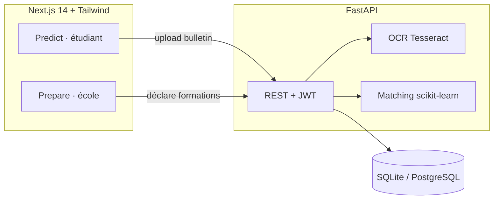
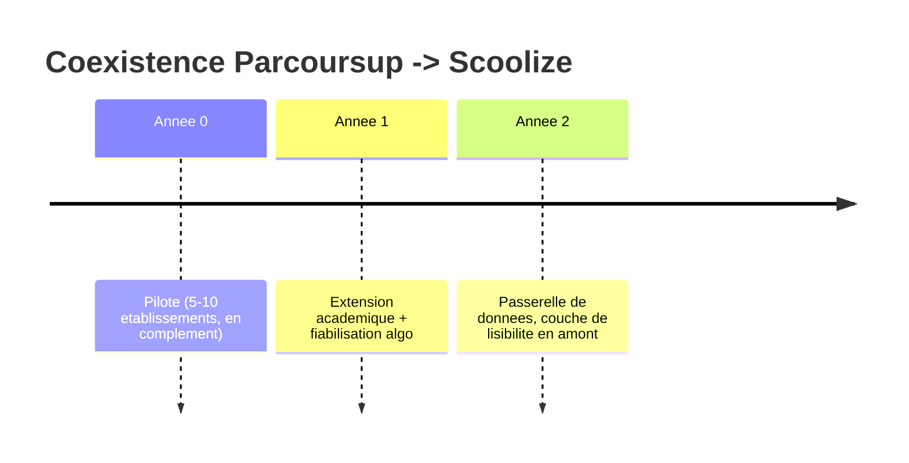

# Scoolize
### L'orientation post-bac, enfin lisible

Prepare (écoles) · Predict (étudiants)

_Paul-Adrien Desplechin · Hugo · Nino_

---

## 1. Le problème

Parcoursup, vécu par 900 000 lycéens chaque année, concentre trois frustrations :

- **Opacité** — « ai-je une chance ? » reste sans réponse au moment des vœux.
- **Confusion** sélectif / non-sélectif — deux logiques d'admission, une seule
  expérience indifférenciée.
- **Saisie fastidieuse** et anxiogène des notes.

> Résultat : des vœux mal calibrés, du stress, des renoncements.

---

## 2. La vision Scoolize

Une plateforme à deux faces, autour d'une idée : **rendre l'orientation lisible**.

| Predict — étudiant | Prepare — école |
|--------------------|-----------------|
| Importe son bulletin (OCR) | Déclare ses formations |
| Valide ses notes | Définit critères + matières clés |
| Obtient son top 10 expliqué | Suit les candidats matchés |

Score transparent + **probabilité d'admission** + intervalle de confiance.

---

## 3. Démo

1. **Predict** — création de profil → upload du bulletin PDF → l'OCR lit les notes.
2. Validation humaine des notes extraites.
3. **Résultats** — top 10 classé, badges sélectif/non-sélectif, graphique, candidature.
4. **Prepare** — le candidat apparaît côté école, export CSV.

> Captures dans [`docs/screenshots/`](../screenshots/).

---

## 4. Sous le capot

**Le matching en une formule (sélectif) :**

`Score = 100 · (0,5 · P_admission + 0,4 · adéquation_matières + 0,1 · proximité)`

où `P_admission` provient d'une **régression logistique** (marge au seuil × sélectivité).

---

## 5. Métriques (jeu de test)

- **OCR** : 3/3 bulletins de test, **100 % des matières** extraites avec la bonne
  note (format français, virgules, `/20`).
- **Matching** cohérent et discriminant :
  - profil excellent sciences → écoles d'ingé / BUT scientifiques (≈ 93/100) ;
  - profil faible → licences non-sélectives, hors prépas sélectives ;
  - profil éco → formations commerce/gestion.
- **Qualité** : 20 tests automatisés verts (API, OCR, matching).

---

## 6. Conduite du changement (ADKAR)

- **Awareness** — pourquoi : l'opacité de Parcoursup.
- **Desire** — bénéfices clairs pour élèves, familles, écoles.
- **Knowledge** — kits d'onboarding, tutos, FAQ.
- **Ability** — formation des référents, hotline, **accessibilité RGAA**.
- **Reinforcement** — coexistence Parcoursup → Scoolize sur 2 ans + métriques.

**RGPD** : consentement à l'upload, conservation 6 mois, droit à l'oubli,
pas de décision 100 % automatisée.

---

## 7. Roadmap

---

## 8. Équipe & Q&A

| Membre | Rôle |
|--------|------|
| Paul-Adrien Desplechin | Backend, OCR, algo de matching, intégration |
| Hugo | Frontend Predict (étudiant) |
| Nino | Frontend Prepare (école) |

### Merci — vos questions ?
